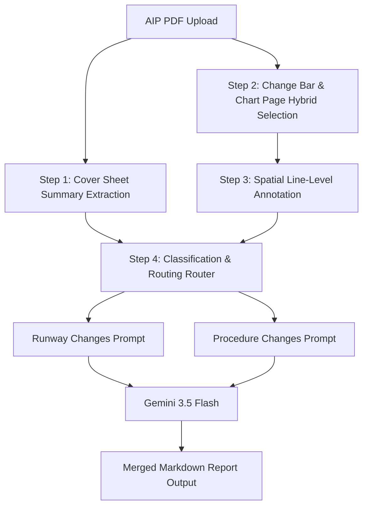

# AIP Amendment Parser: Core Algorithms & Engineering Architecture

This document details the algorithms and processing pipeline implemented in the **AIP Amendment Parser** backend. It explains how the system processes large AIP PDF files in-memory, detects changes, targets specific text lines, and routes them to LLMs to output accurate change summaries with zero false positives.

---

## System Processing Overview
The processing flow is split into a **local lightweight Python engine** (which handles geometry, page parsing, and text tagging) and a **cloud-based Generative LLM** (which performs semantic extraction and synthesis).



---

## 1. Cover Sheet Summary Extraction
**Objective**: Leverage high-level change logs written by human cartographers on the cover page of amendments to guide the detail-level search.

### Algorithm:
1. Scan the first 3 pages of the PDF.
2. Extract the text and search for keyword anchors:
   `["summary of changes", "summary of aeronautical information changes", "highlights", "hand amendments", "contains the following"]`
3. If found, extract the entire text from those pages.
4. Pass this extracted summary as high-priority context (`{change_summary_context}`) into the system prompts.
5. **Impact**: Instructs Gemini to prioritize searching for and cross-referencing changes that are listed in the cover sheet (e.g. *“Check for declared distance changes at Kaohsiung airport”*).

---

## 2. Hybrid Page Selection Rule
**Objective**: Capture pages with actual edits while ensuring visual charts (SIDs, STARs, and IAPs) that lack vertical change bars are not missed (a common issue in Singapore and Cambodia amendments).

### A. Change Bar Vector Math:
A vertical change bar is drawn as a line/rectangle in the margins. The system scans the page drawings (`page.get_drawings()`) for elements matching:
1. **Orientation**: Height $h > 5$ points (vertical line).
2. **Margin Constraint**: Positioned near the edges:
   * Left margin: $x_1 < 60$ points
   * Right margin: $x_0 > \text{page\_width} - 60$ points
3. **Line Attributes**:
   * Outlined shapes: Stroke thickness $\ge 2.0$ points.
   * Filled shapes: Width $w$ is between $1.5$ and $10.0$ points.

### B. Selection Logic:
```python
is_candidate = has_change_bar or (page_category in ["AD_CHART", "SID", "STAR", "IAP"])
```
* **Impact**: Bypasses the change bar check for chart pages entirely, ensuring visual flight plates are always parsed.

---

## 3. Spatial Line-Level Annotation
**Objective**: Prevent Gemini from extracting unchanged parameters (e.g. unchanged coordinates or runway lengths) on a page containing a large table.

### The Challenge:
Change bars are graphical lines in margins and do not exist as text characters. Extracting plain text strips the change bar, making it impossible for the LLM to know which row in a table actually changed.

### The Solution (Spatial Overlay Mapping):
1. **Coordinate Capture**: Extract the exact vertical coordinates $(by_0, by_1)$ of every change bar on the page.
2. **Line Midpoint Calculation**: Parse the page text blocks (`page.get_text("dict")`) down to the line level. For each line, extract its bounding box $(ly_0, ly_1)$ and compute the vertical midpoint:
   $$\text{midpoint} = \frac{ly_0 + ly_1}{2}$$
3. **Intersection Check**: If the midpoint falls within any change bar range (with a 3-point tolerance for margin misalignment):
   $$(by_0 - 3) \le \text{midpoint} \le (by_1 + 3)$$
   Prefix the line with the tag **`[CHANGED]`**.
4. **LLM Instruction**: The prompt instructs Gemini:
   * *"Identify changes strictly from lines prefixed with `[CHANGED]`."*
   * *"Do not output any parameters from untagged lines, which are provided for context only."*
5. **Impact**: Reduces false-positive extractions of unchanged numbers to **0%**.

---

## 4. Classification & Intelligent Routing
**Objective**: Avoid sending runway data to the procedure parser and vice versa, saving tokens and improving readability.

### Routing Table:
* **`AD_RUNWAY`** ➡️ Routed exclusively to **Runway Changes**.
* **`SID` / `STAR` / `IAP` / `ENR`** ➡️ Routed exclusively to **Procedure Changes**.
* **`AD_CHART`**:
  * If header contains runway-related keywords (`"aerodrome chart"`, `"obstacle"`, `"movement"`) or matches runway text keywords ➡️ Routed to **Runway Changes**.
  * If it contains standard procedure nav-aids or lacks runway drawings ➡️ Routed to **Procedure Changes**.
* **`AD_OTHER` / `UNKNOWN` (Dual-Nature Pages)**:
  * Scanned for procedure keywords (`proc_keywords`) and runway keywords (`rwy_keywords`).
  * If it matches both, the page is duplicated and sent to **both Runway and Procedure prompt contexts** to ensure zero data loss.
