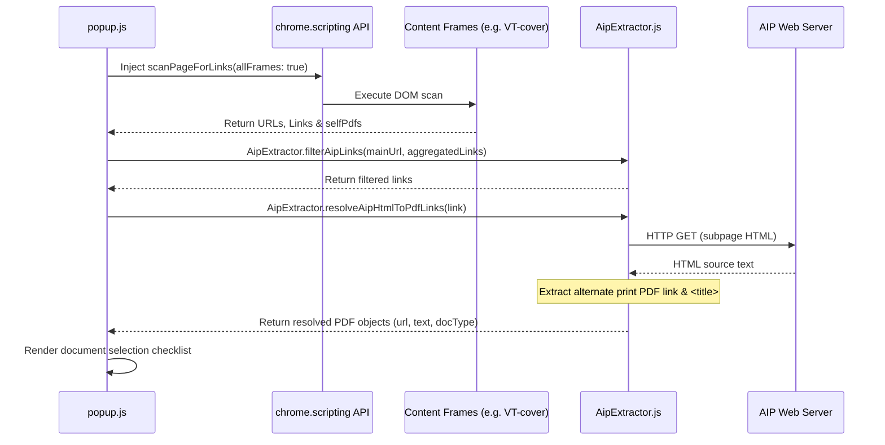

# Technical Design: Declarative Extractor Architecture

This document describes the design and extensibility model of the AIP PDF Summarizer's Link Extraction and PDF Resolution engine.

## 1. Context & Objectives

AIP (Aeronautical Information Publication) portals vary significantly by region. While many use the standard Eurocontrol eAIP layout (structured HTML framesets), others use custom CMS interfaces or standard file tables. 

To keep the extension codebase clean and maintainable, we separate the **UI Interaction Layer** from the **Document Scraper Layer**. The scraping and resolution logic is configuration-driven, meaning that new regions can be supported simply by adding a configuration object rather than writing custom parsing code.

---

## 2. Core Components

The architecture consists of three distinct layers:

```
┌────────────────────────────────────────────────────────┐
│                        UI Layer                        │
│                       (popup.js)                       │
│  - Captures Tab context                                │
│  - Triggers Frame Injector                             │
│  - Renders document list & checkboxes                  │
└───────────────────────────┬────────────────────────────┘
                            │ (Aggregated Scanned Links)
                            ▼
┌────────────────────────────────────────────────────────┐
│                   Extractor Engine                     │
│                   (aipExtractor.js)                    │
│  - Config Registry: AIP_CONFIGS                        │
│  - Filtering: filterAipLinks()                         │
│  - Resolution: resolveAipHtmlToPdfLinks()              │
└───────────────────────────┬────────────────────────────┘
                            │ (Fetched Target Page HTML)
                            ▼
┌────────────────────────────────────────────────────────┐
│                 AIP Portal Web Server                  │
│  - Serves index-en-GB.html / VT-cover-en-GB.html       │
│  - Serves eSUP subpages (with alternate print PDF)    │
│  - Serves direct PDFs                                  │
└────────────────────────────────────────────────────────┘
```

### A. DOM Scanner (`scanPageForLinks`)
Runs dynamically inside all active frames using Chrome's `allFrames: true` script injection API. It does not attempt cross-frame DOM traversal (which fails due to Site Isolation security). Instead, it acts as a lightweight collector returning:
- The frame's current URL.
- All anchor tag links (`a[href]`) and their text.
- Any print-alternate PDF link declared in the frame's `<head>`.

### B. Extractor Registry (`AIP_CONFIGS`)
A central registry of declarative country/site strategies. Each config object defines:
- `name`: Human-readable identifier.
- `match(url)`: Evaluation function returning `true` if the strategy applies to the URL.
- `filter`: Include and exclude keywords used during link scanning.

### C. Resolution Engine (`resolveAipHtmlToPdfLinks`)
Fetches the target HTML of folder links or individual supplement subpages, parses their headers or nested frames, and extracts the target Print-Alternate PDF URL.

---

## 3. Scraper & Resolution Flow



---

## 4. Declarative Configuration Schema

Configurations are stored in [`aipExtractor.js`](file:///Users/wsl/Code/AIP_Reader/aip-pdf-summarizer/aipExtractor.js) in the `AIP_CONFIGS` array:

```javascript
{
  name: "CountryName",
  
  // Decides if this strategy handles the current web page URL
  match: (url) => url.includes('domain.gov'),
  
  filter: {
    // Keywords required in URL or Link text to qualify as an AIP document
    include: ['sup', 'aic', 'amdt', 'pdf'],
    
    // Keywords to immediately reject
    exclude: ['help', 'images/', '.css']
  }
}
```

---

## 5. Standard eAIP Resolution Protocol

Many countries follow the Eurocontrol eAIP standard. Standard eAIP structures represent supplements and circulars as standalone HTML pages that specify their corresponding PDF print documents in their `<head>`:

```html
<head>
  ...
  <link rel="alternate" type="application/pdf" media="print" href="../../pdf/VT-eSUP-26-23.pdf" />
  <title>SUP 23/26 PHUKET AIRPORT RUNWAY CLOSURE</title>
</head>
```

Our engine automatically exploits this standard:
1. It fetches the HTML content of the subpage.
2. It parses the `<link>` tag to extract the relative print alternate PDF path and resolves it to a absolute URL.
3. If the link text in the index page was generic (e.g., "A23/26" or "Click here"), it automatically extracts the `<title>` from the subpage to populate the checklist with a descriptive name.

---

## 6. How to Add Support for a New Country

To add support for a new country, follow these steps:

### Step 1: Define the Configuration
Add a new object to the `AIP_CONFIGS` array in [`aipExtractor.js`](file:///Users/wsl/Code/AIP_Reader/aip-pdf-summarizer/aipExtractor.js). Place it before the `Default eAIP` fallback object (which is always last).

```javascript
{
  name: "Singapore",
  match: (url) => url.includes('caas.gov.sg'),
  filter: {
    include: ['sup', 'aic', 'amdt', 'pdf', 'circular', 'supplement'],
    exclude: ['help', 'styles/']
  }
}
```

### Step 2: Validate the Rules
Open the new country's AIP site in Chrome, activate the extension, and verify that:
1. The matching configs load successfully.
2. The document scanner runs and lists all valid AMDT, SUP, and AIC documents.
3. No redundant assets (e.g., stylesheets, images) pass the filters.

---

## 7. Error Handling & Security Guidelines

- **Same-Origin Policy**: All subpage fetches are done from the extension popup. Same-origin rules are respected, and cross-origin requests are naturally bypassed because the extension has `<all_urls>` permission, avoiding CORS errors.
- **Fail-Safe Processing**: If `fetch()` on a link fails (returns non-200 status or network error), the extractor catches the error and silently drops or returns the unresolved URL, preventing UI lockups.
- **Support local file paths**: Local files using `file:///` paths are supported, enabling testing on downloaded eAIP packages.
